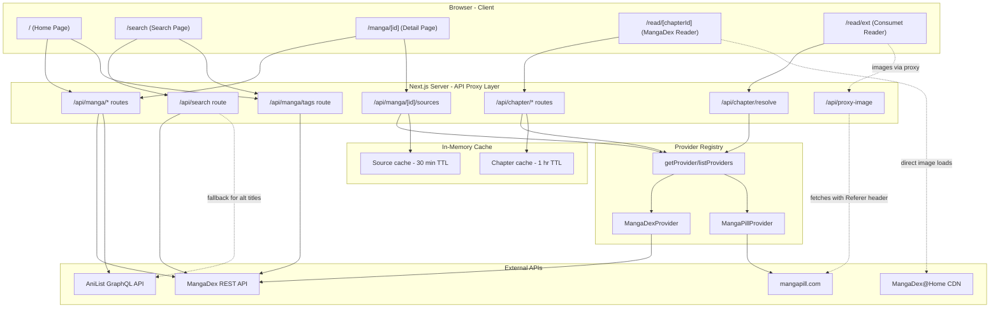
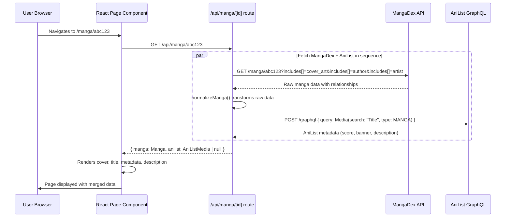
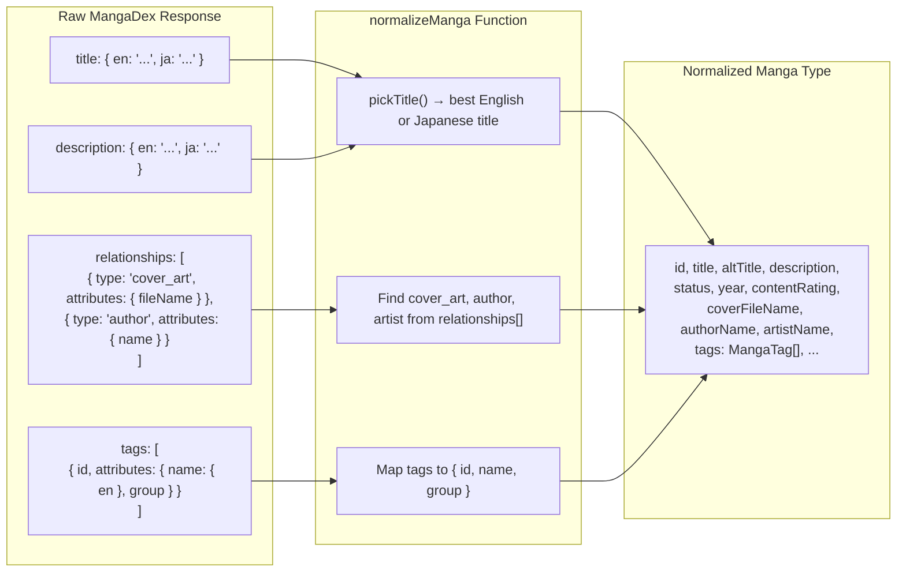
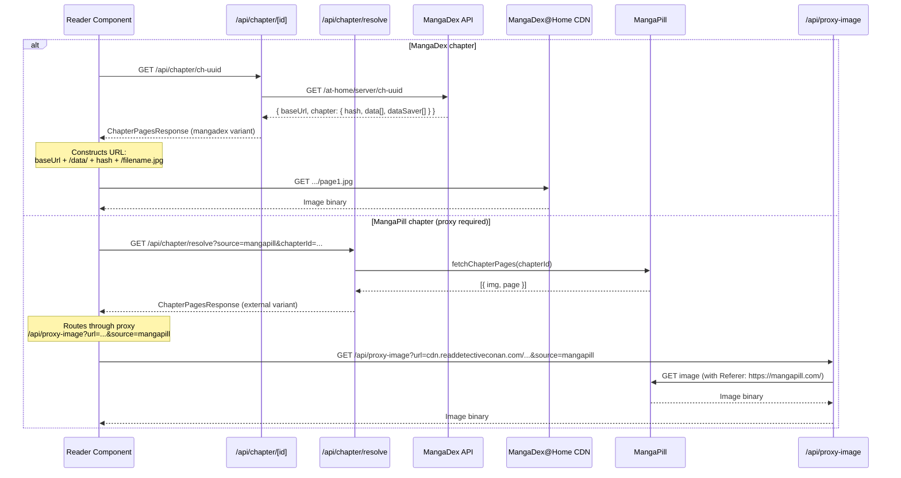
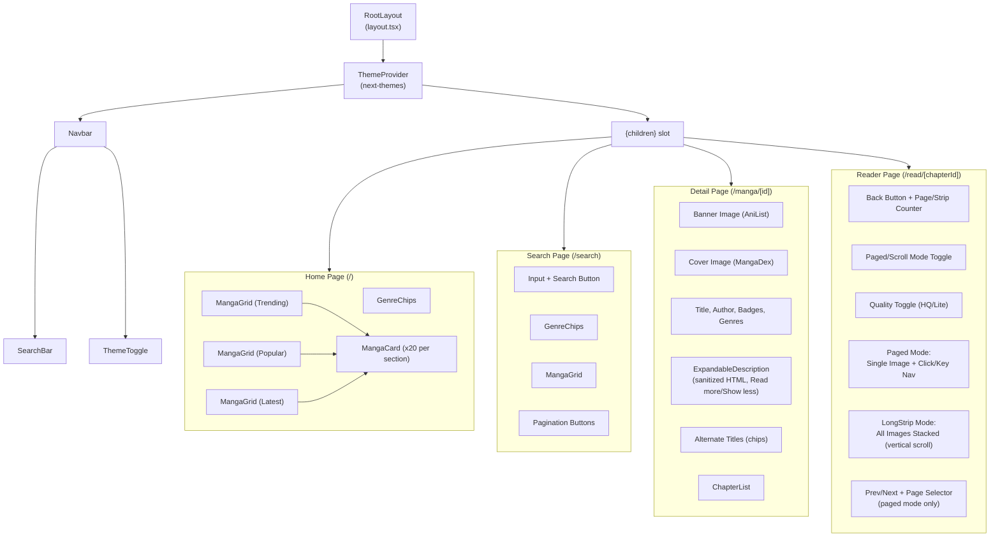

# Architecture

This document describes the system architecture of Tanso, including all diagrams, data flows, and the reasoning behind each design decision.

---

## Table of Contents

1. [High-Level Architecture](#1-high-level-architecture)
2. [Request Flow](#2-request-flow)
3. [Data Normalization Flow](#3-data-normalization-flow)
4. [Image Delivery Pipeline](#4-image-delivery-pipeline)
5. [Project Structure](#5-project-structure)
6. [Component Hierarchy](#6-component-hierarchy)
7. [API Route Map](#7-api-route-map)

---

## 1. High-Level Architecture



### Explanation

The application follows a **multi-tier architecture**:

1. **Browser (Client):** React components running in the user's browser. All pages are client-side rendered (`"use client"`) to support interactive features like genre filtering, source tab switching, page-by-page reading, and keyboard navigation. The client never calls external APIs directly (except for image loads from CDNs).

2. **Next.js API Proxy (Server):** All data requests are routed through Next.js API route handlers under `/api/`. This layer serves multiple purposes:
   - **Avoids CORS issues** — Browser-to-MangaDex requests would be blocked by CORS. Server-to-server requests have no such restriction.
   - **Data merging** — The `/api/manga/[id]` route fetches from both MangaDex and AniList, then returns a combined response.
   - **Provider abstraction** — The provider registry pattern lets API routes handle any source (MangaDex, MangaReader, etc.) through a common interface.
   - **Caching** — In-memory LRU caches for source discovery and chapter lists prevent redundant API calls.
   - **Security** — The image proxy route validates domains and referers to prevent SSRF attacks.

3. **Provider Registry:** An abstraction layer (`src/lib/providers/`) that wraps content sources behind a `ContentProvider` interface. Currently includes MangaDex and MangaPill. Adding new providers requires one file + one `registerProvider()` call.

4. **External APIs:** Three data sources:
   - **MangaDex** — Primary source for manga content: titles, chapters, tags, cover images, and chapter page images.
   - **AniList** — Metadata enrichment: community scores, descriptions, banner images, recommendations.
   - **MangaPill** (via `@consumet/extensions`) — Secondary chapter source for manga with DMCA-removed chapters on MangaDex. Images are routed through `/api/proxy-image` because MangaPill's CDN requires a Referer header.

### Why proxy instead of calling APIs directly from the client?

- MangaDex enforces CORS headers that block browser-originated requests.
- Merging two API responses on the server avoids waterfall requests on the client.
- Server-side in-memory caching (e.g., the tag list) works reliably, whereas client caches would repeat per user session.
- If we add rate limiting or API keys in the future, they stay server-side and hidden from users.

---

## 2. Request Flow

This diagram traces a single user action — opening a manga detail page — through every layer.



### Explanation

1. The user clicks a manga card, which triggers Next.js client-side navigation to `/manga/[id]`.
2. The page component (`src/app/manga/[id]/page.tsx`) makes a single `fetch("/api/manga/abc123")` call.
3. The API route handler (`src/app/api/manga/[id]/route.ts`) does two things:
   - Calls `getMangaDetails(id)` which hits `MangaDex GET /manga/{id}` with `includes[]` params to embed cover art, author, and artist data in one request (avoiding extra round-trips).
   - Takes the manga title from the MangaDex response and passes it to `searchAniListManga(title)` which does a `POST` to AniList's GraphQL endpoint.
4. Both results are combined into `{ manga, anilist }` and returned to the client.
5. The React component renders the merged data: MangaDex cover image, AniList banner image, MangaDex genres/tags, AniList score, and the best available description (AniList preferred, MangaDex as fallback).

This pattern means the client makes **one** HTTP request per page, and the server handles all API orchestration.

---

## 3. Data Normalization Flow



### Explanation

MangaDex returns deeply nested, multilingual JSON. Our `normalizeManga()` function in `src/lib/mangadex.ts` transforms this into a flat, predictable `Manga` TypeScript interface:

**Title resolution (`pickTitle`):**
- Prefers English (`en`), falls back to Japanese romanized (`ja-ro`), then Japanese (`ja`), then the first available language.
- If both English and Japanese titles exist and differ, the Japanese title becomes `altTitle`.
- The detail page collects all alternate titles from MangaDex (`altTitle`) and AniList (`title.romaji`, `title.english`, `title.native`), deduplicates them, and displays them as styled chips under an "Alternate Titles" heading.

**Relationship extraction:**
- MangaDex embeds related entities (cover art, author, artist) in a `relationships[]` array when you include them via `includes[]` query params.
- `normalizeManga()` finds each by `type` and extracts the relevant attributes (`fileName` for covers, `name` for authors/artists).

**Tag mapping:**
- Raw tags have nested `{ attributes: { name: { en: "Action" }, group: "genre" } }`.
- Normalized to `{ id, name, group }` for easy filtering (e.g., filtering to `group === "genre"` for the genre chips).

The same pattern applies to chapters via `normalizeChapter()`, which extracts the scanlation group name from the relationships array.

---

## 4. Image Delivery Pipeline



### Explanation

Chapter images are delivered through different pipelines depending on the source:

**MangaDex chapters** use the **MangaDex@Home** network, a volunteer-run CDN:
1. The API route calls `GET /at-home/server/{chapterId}` which returns `baseUrl`, `hash`, `data[]` (original filenames), `dataSaver[]` (compressed).
2. The client builds full image URLs: `{baseUrl}/data/{hash}/{filename}` (HQ) or `{baseUrl}/data-saver/{hash}/{filename}` (Lite).
3. Base URL is valid ~15 minutes.

**MangaPill chapters** (via `@consumet/extensions`) require server-side proxying:
1. The API route calls `provider.getChapterPages(chapterId)` which scrapes the source.
2. The response contains `pages[]` with `img` (CDN URL) and `page` (number).
3. MangaPill's CDN (`cdn.readdetectiveconan.com`) returns 403 without a `Referer: https://mangapill.com/` header — browsers don't send this header when loading from `localhost`.
4. The reader detects `PROXIED_SOURCES` (currently `["mangapill"]`) and routes image URLs through `/api/proxy-image?url=...&source=mangapill`, which adds the required Referer header server-side.

In **paged mode**, both pipelines preload the next 3 pages using `new Image()` objects.

**Cover images** follow a simpler pattern with a stable CDN:
```
https://uploads.mangadex.org/covers/{mangaId}/{coverFileName}.256.jpg
```
Available sizes: `.256.jpg` (thumbnail), `.512.jpg` (medium), or no suffix (original).

---

## 5. Project Structure

```
tanso/
├── docs/                              # Project documentation
│   ├── ARCHITECTURE.md                # This file — diagrams and design explanations
│   ├── COMMANDS.md                    # All commands for setup, dev, build
│   ├── PLAN.md                        # Living project plan and roadmap
│   └── PROJECT_GUIDE.md              # End-to-end project walkthrough
│
├── src/
│   ├── app/                           # Next.js App Router
│   │   ├── layout.tsx                 # Root layout: fonts, ThemeProvider, Navbar, <main> wrapper
│   │   ├── page.tsx                   # Home page: genre chips + trending/popular/latest grids
│   │   ├── search/
│   │   │   └── page.tsx               # Search: query input, genre filters, paginated results
│   │   ├── manga/
│   │   │   └── [id]/
│   │   │       └── page.tsx           # Manga detail: cover, metadata, AniList enrichment, chapter list
│   │   ├── read/
│   │   │   ├── [chapterId]/
│   │   │   │   └── page.tsx           # Reader: paged + longstrip modes, auto-detects webtoons, quality toggle
│   │   │   └── ext/
│   │   │       └── page.tsx           # Consumet reader: query-param entry point for external sources
│   │   └── api/                       # Server-side API routes (proxy layer)
│   │       ├── manga/
│   │       │   ├── trending/route.ts  # GET — top-rated manga
│   │       │   ├── popular/route.ts   # GET — most-followed manga
│   │       │   ├── latest/route.ts    # GET — recently updated manga
│   │       │   ├── tags/route.ts      # GET — all MangaDex genre/theme tags
│   │       │   └── [id]/
│   │       │       ├── route.ts       # GET — manga details (MangaDex + AniList merged)
│   │       │       ├── chapters/route.ts  # GET — multi-source chapter list via provider registry
│   │       │       └── sources/route.ts   # GET — source discovery (progressive loading)
│   │       ├── chapter/
│   │       │   ├── [id]/route.ts      # GET — MangaDex chapter page images
│   │       │   └── resolve/route.ts   # GET — Consumet chapter page images (query-param based)
│   │       ├── proxy-image/route.ts   # GET — secured image proxy (domain whitelist, SSRF prevention)
│   │       └── search/route.ts        # GET — search with query + genre filters
│   │
│   ├── components/
│   │   ├── ui/                        # shadcn/ui primitives (Button, Badge, Input, Skeleton, etc.)
│   │   ├── navbar.tsx                 # Sticky top bar: logo, search bar, theme toggle
│   │   ├── search-bar.tsx             # Search input with form submission
│   │   ├── theme-toggle.tsx           # Dark/light mode switch button
│   │   ├── genre-chips.tsx            # Horizontal scrollable genre pill selector
│   │   ├── manga-card.tsx             # Single manga card (cover, title, author)
│   │   ├── manga-grid.tsx             # Responsive grid of MangaCard components
│   │   └── chapter-list.tsx           # Multi-source chapter list with source tabs
│   │
│   ├── lib/
│   │   ├── providers/                 # Provider registry (extensible for anime/LN)
│   │   │   ├── types.ts              # ContentProvider interface, ProviderSearchResult
│   │   │   ├── index.ts              # Registry: registerProvider, getProvider, listProviders
│   │   │   ├── mangadex.ts           # MangaDex ContentProvider wrapper
│   │   │   └── mangareader.ts        # MangaPill ContentProvider wrapper (@consumet/extensions)
│   │   ├── mangadex.ts                # MangaDex API client — all fetch + normalize functions
│   │   ├── anilist.ts                 # AniList GraphQL client — metadata enrichment
│   │   ├── cache.ts                   # TTLCache for source discovery and chapter lists
│   │   ├── matching.ts                # Title scoring algorithm for cross-provider matching
│   │   └── utils.ts                   # Tailwind CSS utility (cn function from shadcn)
│   │
│   └── types/
│       ├── manga.ts                   # Manga, Chapter, MangaSource, ChapterPagesResponse, etc.
│       └── anilist.ts                 # AniListMedia, AniListResponse
│
├── public/                            # Static assets
├── next.config.ts                     # Image remote patterns, serverExternalPackages
├── package.json                       # Dependencies and scripts
├── tsconfig.json                      # TypeScript configuration
└── README.md                          # Project overview with links to docs/
```

### Explanation

The structure follows **Next.js App Router conventions**:

- **`src/app/`** — File-based routing. Each folder with a `page.tsx` becomes a URL route. Folders with `route.ts` files under `api/` become server-side API endpoints.
- **`src/components/`** — Reusable UI components. The `ui/` subfolder is managed by shadcn/ui (auto-generated); custom components sit alongside it.
- **`src/lib/`** — Server/shared logic. The API clients live here and are imported by both API routes (server-side) and by utility functions.
- **`src/types/`** — TypeScript interfaces shared between the API clients and the React components.
- **`docs/`** — All project documentation. Kept in the repo so it stays versioned alongside the code.

---

## 6. Component Hierarchy



### Explanation

**Root layout** (`layout.tsx`) wraps every page:
- `ThemeProvider` from `next-themes` provides dark/light mode context to the entire app.
- `Navbar` is always visible — it contains the `SearchBar` (form that navigates to `/search?q=...`) and the `ThemeToggle` (sun/moon icon button).
- `{children}` is the slot where the current page renders.

**Home page** — Three `MangaGrid` instances, each fed by a `useMangaSection` hook that fetches from `/api/manga/trending`, `/api/manga/popular`, or `/api/manga/latest`. A shared `GenreChips` component at the top controls tag filtering for all three grids.

**Search page** — An `Input` form plus `GenreChips` for filtering, a `MangaGrid` for results, and pagination buttons. State is driven by URL search params (`?q=...&genres=...&page=1`).

**Detail page** — Composed of individual elements: banner image, cover, metadata badges, genres, an `ExpandableDescription` (sanitizes AniList HTML, clamps to 4 lines with "Read full description" toggle), an "Alternate Titles" section (chips from MangaDex + AniList), and a `ChapterList` component that manages source tabs and pagination.

**Reader page** — Supports two reading modes:
- **Paged mode** (default for standard manga): Single `<Image>` element per page, click left/right halves or use arrow keys to navigate, Previous/Next buttons, page selector dropdown, and quality toggle (HQ/Lite for MangaDex).
- **Long-strip mode** (auto-detected for webtoons): All images stacked vertically at full width with lazy loading. Auto-activates when the second page's height/width ratio exceeds 3 (characteristic of webtoon vertical strips). Users can manually toggle between modes via the "Paged" / "Scroll" button.

---

## 7. API Route Map

| Route | Method | Query Parameters | Upstream API | Description |
|---|---|---|---|---|
| `/api/manga/trending` | GET | `tags` (repeatable) | MangaDex `GET /manga` ordered by `rating desc` | Top-rated manga, optionally filtered by genre tags |
| `/api/manga/popular` | GET | `tags` (repeatable) | MangaDex `GET /manga` ordered by `followedCount desc` | Most-followed manga, optionally filtered by genre tags |
| `/api/manga/latest` | GET | `tags` (repeatable) | MangaDex `GET /manga` ordered by `latestUploadedChapter desc` | Recently updated manga, optionally filtered by genre tags |
| `/api/manga/tags` | GET | — | MangaDex `GET /manga/tag` | Full list of all genre/theme tags (cached in memory) |
| `/api/manga/[id]` | GET | — | MangaDex `GET /manga/{id}` + AniList `POST /graphql` | Manga details merged with AniList metadata (score, banner, description) |
| `/api/manga/[id]/chapters` | GET | `source`, `sourceId`, `page`, `lang` | Provider registry | Multi-source chapter list. MangaDex: server pagination. Others: full list, cached. |
| `/api/manga/[id]/sources` | GET | `title` (required), `lastChapter`, `anilistId`, `status`, `altTitles` (pipe-separated) | Provider registry + scoring | Discovers available sources for a manga. Tries alternate titles as fallback if primary title yields no matches. Results cached 30 min. |
| `/api/chapter/[id]` | GET | — | MangaDex `GET /at-home/server/{id}` | MangaDex chapter page images (ChapterPagesResponse, mangadex variant) |
| `/api/chapter/resolve` | GET | `source`, `chapterId` | Provider registry | Consumet chapter page images (ChapterPagesResponse, external variant) |
| `/api/proxy-image` | GET | `url`, `source` | Direct fetch with domain whitelist | Secured image proxy. HTTPS-only, rate limited, server-side referer. |
| `/api/search` | GET | `q` (query), `page` (default 1), `genres` (repeatable) | MangaDex `GET /manga` + AniList `POST /graphql` (fallback) | Search manga by title with optional genre filtering. Falls back to AniList for alt titles. |

### Explanation

All routes follow the same pattern:

1. Parse query parameters from the incoming request.
2. Call the appropriate function — either directly (`src/lib/mangadex.ts`, `src/lib/anilist.ts`) or via the provider registry (`src/lib/providers/`).
3. Return the normalized result as JSON.
4. On error, return `{ error: "..." }` with a 500 status code.

**Multi-source routes** (`/api/manga/[id]/chapters`, `/api/manga/[id]/sources`, `/api/chapter/resolve`) use the provider registry to dispatch to the correct provider. The `source` parameter determines which `ContentProvider` implementation handles the request.

**Caching strategy:**
- `/api/manga/tags` — In-memory module-level cache (never expires, tags rarely change)
- `/api/manga/[id]/sources` — `TTLCache` with 30 min TTL, max 500 entries
- `/api/manga/[id]/chapters` (non-MangaDex) — `TTLCache` with 1 hr TTL, max 200 entries

**Security:** The `/api/proxy-image` route prevents SSRF by maintaining a whitelist of allowed image domains and mapping source names to referer headers server-side. It never accepts arbitrary URLs or referers from clients.
